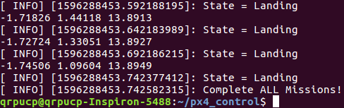

2020夏-机器人操作系统大作业
----

```my_turtlectl```为第四讲课程报告中控制小乌龟移动的ROS工作空间。运行以下指令即可运行程序：

```shell
#Terminal 1
roscore
#Terminal 2
rosrun turtlesim turtlesim_node
#Terminal 3
cd ~/my_turtlectl
source devel/setup.bash
rosrun my_turtlectl my_turtle_pub
```

运行结果如下图所示：


```px4_control```为第八讲报告中的ROS工作空间，其中```off_board```包是官网程序以及学长编写的单飞机穿框程序，```motion_planning```是我自己编写的控制飞机执行任务的程序。

```motion_planning```包的文件结构如下：


运行以下指令即可运行代码：

```shell
#Terminal 1
cd ~/src/Firmware
make posix_sitl_default gazebo
#Terminal 2
roslaunch mavros px4.launch fcu_url:="udp://:14540@127.0.0.1:14557"
#Terminal 3
cd ~/px4_control
source devel/setup.bash
rosrun motion_planning offboard_node
#Terminal 4
cd ~/px4_control
source devel/setup.bash
rosrun motion_planning camera_node
```

代码运行结果如下图所示：




其中用黄色圆圈圈起来的部分为两个箱子的位置，飞机曾在这两处降落。